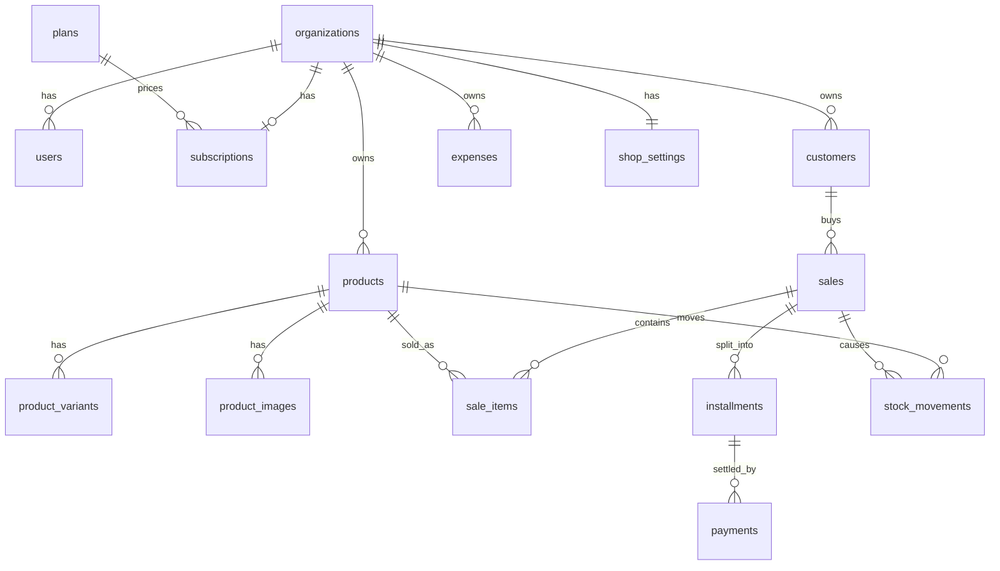

# Esboço do banco de dados

Multitenancy por `organization_id` (mesmo padrão de `users`), aplicado via `App\Models\Concerns\BelongsToTenant`.
Dinheiro sempre em **centavos** (`unsignedInteger`/`bigInteger`). Tabelas marcadas com 🏢 são escopadas por tenant.

## Globais (super admin)

| Tabela | Colunas principais |
| --- | --- |
| `plans` | `name`, `price_cents`, `limits` (json: `max_products`, `max_customers`, `max_users`), `active` |
| `subscriptions` | `organization_id`, `plan_id`, `status`, `price_cents` (congela o preço; base do MRR), `current_period_end` |
| `organizations` (existe) | + `plan_id` opcional; `status` já existe (ativar/bloquear) |
| `users` (existe) | `organization_id`, `locale` |

MRR = soma de `subscriptions.price_cents` com `status = active`.

## Tenant 🏢 (todas com `organization_id` indexado)

| Tabela | Colunas principais |
| --- | --- |
| `customers` | `name`, `phone`, `notes`, `public_token` (único, aleatório ≥ 32 chars, rotacionável) |
| `products` | `name`, `description`, `price_cents`, `stock_qty`, `min_stock`, `active` |
| `product_variants` | `product_id`, `name`, `sku`, `price_cents` (null = herda), `stock_qty` |
| `product_images` | `product_id`, `path`, `position` |
| `sales` | `customer_id` (null = venda balcão), `total_cents`, `status`, `sold_at` |
| `sale_items` | `sale_id`, `product_id`, `product_variant_id`, `quantity`, `unit_price_cents` |
| `installments` | `sale_id`, `customer_id`, `number`, `amount_cents`, `due_date` (fiado = 1 parcela; parcelado = N) |
| `payments` | `installment_id`, `amount_cents`, `method` (pix/cash/card), `paid_at` |
| `expenses` | `description`, `amount_cents`, `category`, `paid_at` |
| `stock_movements` | `product_id`, `product_variant_id`, `quantity_delta`, `reason` (sale/adjustment/return), `sale_id` (null) |
| `shop_settings` | `pix_key`, `pix_key_type`, `catalog_public` (1 linha por organização) |

## Relacionamentos

## Regras que não viram coluna

- **Saldo devedor** do cliente = `sum(installments.amount_cents) − sum(payments.amount_cents)`. Não é coluna, evita divergência.
- **Lucro real** = `sum(payments.amount_cents) − sum(expenses.amount_cents)` no período (regime de caixa).
- **Baixa de estoque**: criar `sale_items` + `stock_movements` (`quantity_delta` negativo) na mesma transação; `stock_qty` é atualizado ali.
- **Página pública** `/p/{token}`: resolve `customers.public_token` sem passar pelo escopo de tenant (`withoutTenant()`), expõe só parcelas, pagamentos e a chave PIX da loja.
- **Índices**: `(organization_id, due_date)` em `installments` (contas a receber), `(organization_id, sold_at)` em `sales`, `public_token` único.
